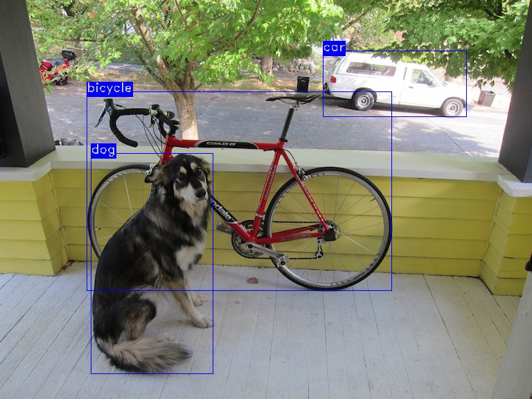

# DINO Detector Using C++ and Libtorch

## Requirement
- CMake 3.0+
- GCC/G++ with CXX STANDARD 17
- [Libtorch](https://pytorch.org/)
- OpenCV 3.4+

## Build

```bash
git clone https://github.com/truongthanhdat/DINO-Libtorch-CPP
cd DINO-Libtorch-CPP
mkdir -p build
cd build
cmake ..
make
```

## Model
The converted Torchscript model can be found [here](https://github.com/truongthanhdat/DINO-Libtorch-CPP/releases/tag/v0.0.1). Or it can be downloaded via the following command:
```
wget https://github.com/truongthanhdat/DINO-Libtorch-CPP/releases/download/v0.0.1/dino_r50_4scale_coco_800_1200
```

Currently, we provide the converted model of [DINO R50 4scale](https://github.com/IDEA-Research/detrex/blob/main/projects/dino/configs/dino_r50_4scale_24ep.py) at the resolution of 1200x800.
The original PyTorch model can be download in [DETREX Model Zoo](https://detrex.readthedocs.io/en/latest/tutorials/Model_Zoo.html).

## Usage

```bash
./build/dino <model path> <image path>
# Example: ./build/dino dino_r50_4scale_coco_800_1200.pt dog.jpg
```



## Notes

The Torchscript model was converted from the original model of DINO provided in [DETREX](https://github.com/IDEA-Research/detrex). The purpose of this repository is to provide an example of using DINO in C++, not to reproduce the DINO results. The detection results produced by the C++ may differ from the results of original repository [DETREX](https://github.com/IDEA-Research/detrex). Currently, the provided model in this repository use a fix input size (1200x800) to the detector. In addition, the current model use the PyTorch version of Multiscale Deformable Attention. Therefore, the inference time could be slower than the [CUDA version](https://github.com/IDEA-Research/detrex/tree/main/detrex/layers/csrc/MsDeformAttn).

## Acknowledgments

This repository is implemented for academic research purposes. We thank to the original repository of [DETREX](https://github.com/IDEA-Research/detrex) for their excellent research and provided pre-trained models.

## Contacts

If you are interested in this project and have any questions, you are welcome to contact me via my personal email address: thanhdattrg@gmail.com
